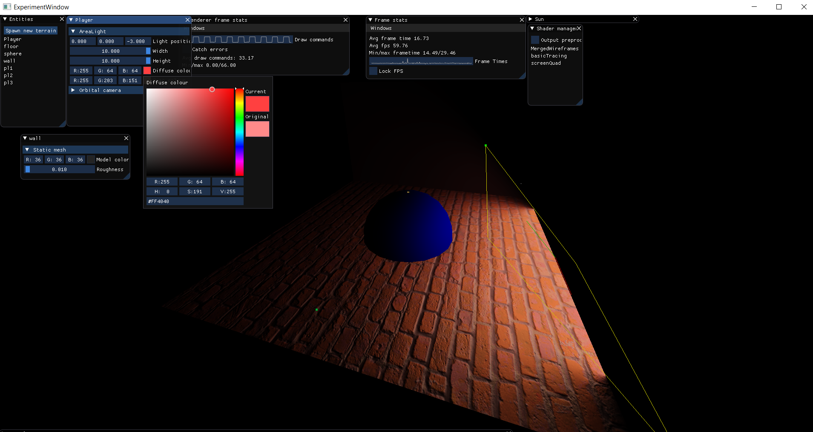
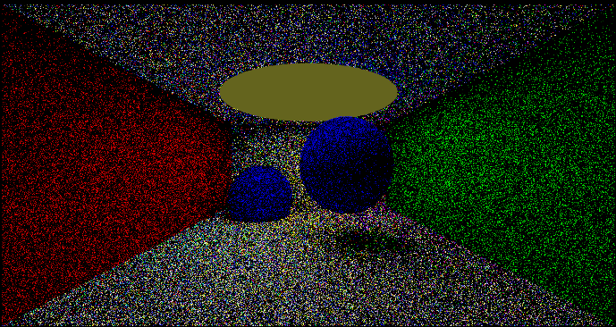
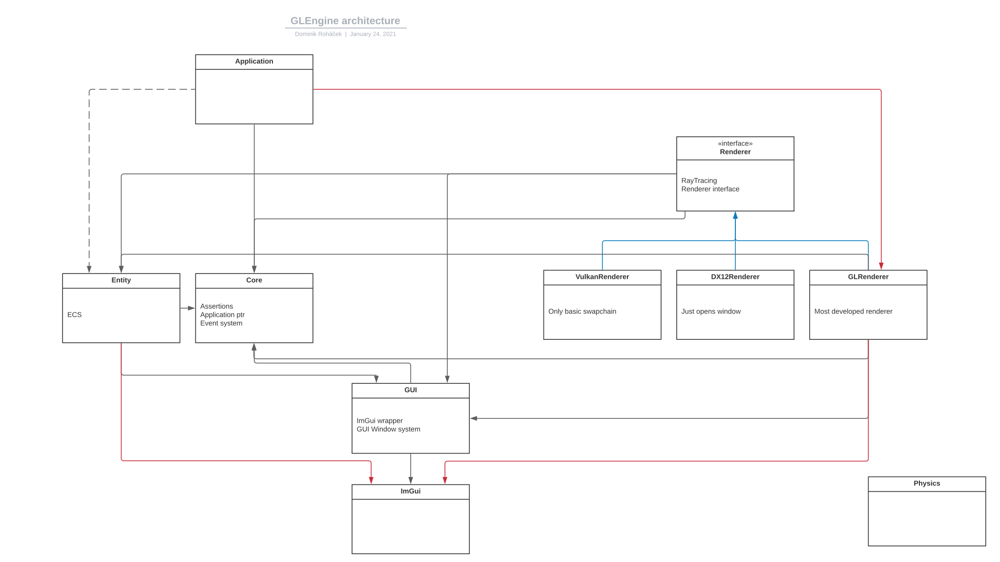

# GLEngine

[](https://github.com/MySchoolEngine/GLEngine/actions?workflow=build)

## About

Personal rendering-engine project by Dominik Roháček, built to explore real-time and offline rendering techniques from first principles.

[LinkedIn](https://www.linkedin.com/in/drohacek/) · [GitHub](https://github.com/RohacekD) · [Blog](https://cornercodes.com)

## Highlights

### Area light shading


Real-time analytic area lights via Linearly Transformed Cosines (Heitz et al., SIGGRAPH 2016) — see [Papers & Techniques](#papers--techniques).

### Path tracing


CPU path tracer validated against the Cornell Box.

<!-- screenshot: real-time OpenGL/DX12 PBR scene -->

<!-- screenshot: editor UI (world view, resource manager, material preview) -->

### Terrain erosion
GPU hydraulic erosion simulation over tessellated terrain — [video demo](https://www.youtube.com/watch?v=UzMCD0z67uU).

### Atmospheric scattering
Sky model based on Mie/Rayleigh phase functions — see the write-up comparing [Mie phase function approximations](https://cornercodes.com/2020/11/04/mie-phase-functions-comparison/) on my blog.

## Features

### Rendering
*  Multi-backend renderer: OpenGL (primary), DirectX 12, and Vulkan (experimental) behind a common interface
*  Physically based shading (GGX microfacet BRDF)
*  Analytic area lights via Linearly Transformed Cosines (Heitz et al., SIGGRAPH 2016)
*  Atmospheric scattering (Mie/Rayleigh) sky model
*  GPU terrain rendering with tessellation and droplet-based hydraulic erosion simulation over a layered rock/sand/dirt representation

### Ray & Path Tracing
*  CPU ray tracer with BVH acceleration structure over triangle meshes, structured after *Physically Based Rendering* (Pharr, Jakob & Humphreys)
*  Path tracing with basic BSDF sampling (Cornell Box validated)

### Engine Architecture
*  Entity Component System
*  RTTR-based reflection: drives XML (de)serialization and editor property panels generically

### Tooling
*  In-house editor: world/scene view, resource manager, material preview, ray-trace preview, entity inspector
*  Shader hot-reload / preprocessor pipeline

### Engineering Practices
*  Unit tests (Google Test) covering core math/physics/serialization, run in CI
*  Microbenchmarks (Google Benchmark) for perf-sensitive code (BVH, AABB, trimesh)
*  Code coverage tooling (OpenCppCoverage)
*  CI build on every push

### Experimental
*  Render graph & PSO cache - in progress, not yet driving all render paths
*  Shadow mapping - implemented but unfinished/rough
*  Vulkan renderer - WIP, build only validated on MSVC
*  Water/fluid surface simulation - early/unfinished
*  Atmospheric renderer - radiance working ok-ish, but the irradiance term is wrong. This means a nice sky picture, but an inaccurate lighting model
*  Skeletal animation - untested for a long time

## Papers & Techniques

Some of the techniques implemented in this project:

*  **Linearly Transformed Cosines** — Heitz, Dupuy, Hill & Neubelt, SIGGRAPH 2016. Real-time analytic area-light shading. See `data/Shaders/basic/basicTracing.glsl` and `GLRenderer/GLRenderer/Lights/LightsUBO.cpp`.
*  **Octahedral unit vector encoding** — Cigolle, Donow, Evangelakos, Mara, McGuire & Meyer, JCGT 2014. Compact normal/direction storage. See `Renderer/Renderer/Textures/TextureView.inl`.
*  **Progressive raytracing** — Arikan & Güdükbay. Coarse-to-fine interleaved scanline refinement for the ray-trace preview. See `Renderer/Renderer/RayCasting/RayGeneration/InterleavedLinesFactory.h`.
*  **Terrain erosion** — droplet-based hydraulic simulation over a layered (rock/sand/dirt) heightmap, in the spirit of Beneš & Forsbach's layered erosion model (SCCG 2001). See `data/Shaders/terrain/erosion.glsl`.
*  Deeper write-up on atmospheric scattering / phase functions on [my blog](https://cornercodes.com/2020/11/04/mie-phase-functions-comparison/).

## Architecture
[](https://lucid.app/lucidchart/invitations/accept/d2772b03-bc43-4301-b71a-b145bfef3e73)

*  Red lines denote wrong dependencies
*  Blue lines denote opposite dependencies
*  The dashed line denotes planned dependency

## Getting Started

```
git clone <https://github.com/RohacekD/GLEngine>
cd GLEngine
git submodule init
git submodule update
premake5 vs2019 (or whatever version you are using)
```

### Vulkan build

You can run both DirectX and OpenGL renderers side by side but in case of Vulkan you need to choose between OpenGL and Vulkan. If you would like to select Vulkan you need to set premake in this way:
```
premake5 --glfwapi=vulkan vs2019
```

### Skip tests (faster builds)

If you want to skip building test projects and static library variants (used for testing internal types), you can use:
```
premake5 --skiptests vs2019
```

This option can be combined with other options:
```
premake5 --glfwapi=vulkan --skiptests vs2019
```

### Benchmarks

Microbenchmarks are not built by default. Pass `--benchmarks` to include them:
```
premake5 --benchmarks vs2022
```

See [Benchmarks/readme.md](Benchmarks/readme.md) for details.

### clangd / LSP support

To generate `compile_commands.json` for clangd (used by editors and AI tools for code intelligence):
```
premake5 export-compile-commands
```

This automatically copies `compile_commands/debug.json` to the root `compile_commands.json`. Re-run after any premake changes.

### Memory sanitizer
If you want to use the memory sanitizer, please use the Asan configuration and add the path to the ASAN DLLs to your PATH variable. E.g.:
```
C:\Program Files\Microsoft Visual Studio\2022\Community\VC\Tools\MSVC\14.44.35207\bin\Hostx64\x64
```

## Testing & Benchmarks

Unit tests (Google Test) and microbenchmarks (Google Benchmark) both run against this codebase and are checked in CI.

*  See [Tests/readme.md](Tests/readme.md) for test structure, conventions, and how to run them.
*  See [Benchmarks/readme.md](Benchmarks/readme.md) for how to build and run microbenchmarks.

## Documentation
Most of the documentation can be found here on GitHub or in-code.

Some user/programmer documentation can be found [here](https://rohacekd.github.io/GLEngine-Documentation/). (OBSOLETE)

There's also a short [documentation](CodeDocumentation.md) for less obvious cases, to help with development.

## Contributing
This repository is open for contribution. You can start by reading [this](CONTRIBUTING.md). If you have any questions regarding code or features feel free to contact me.

## Licensing
License can be found in [LICENSE](LICENSE)
